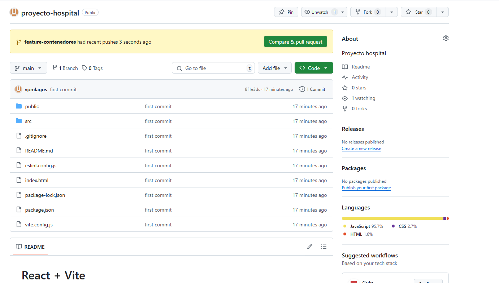

## README ##

npm i bootstrap react-bootstrap
npm i -D sass
npm install react-router-dom
npm install axios

### CREACIÓN DOCKERFILE ###

Se crea un dockerfile para la creación del respectivo contenedor, facilitando su portabilidad, todo desde la rama feature-contenedores

FROM node:18 AS builder
WORKDIR /app

COPY package*.json ./
RUN npm install
COPY . .
RUN npm run build

FROM nginx:stable-alpine
RUN rm -rf /usr/share/nginx/html/*
COPY --from=builder /app/dist /usr/share/nginx/html
EXPOSE 80

CMD ["nginx", "-g", "daemon off;"]

Y posteriormente se levanta utilizando un archivo YAML:

version: '3.9'

services:
  frontend:
    build:
      context: .
      dockerfile: Dockerfile
    container_name: react_frontend
    ports:
      - "3000:80"
    restart: unless-stopped

Utilizando los siguientes comandos:

docker-compose down --volumes
docker system prune -f --volumes
docker-compose up --build

Si el navegador muestra una versión antigua fuerza la actualización Ctrl + Shift + R

Checkout a la rama feature-contenedores

